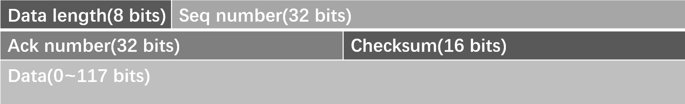
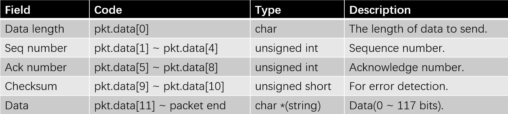
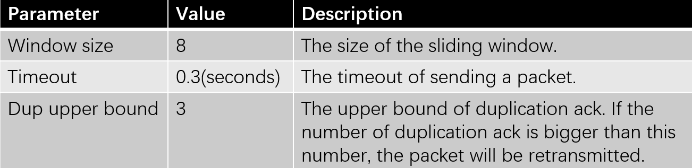

# Lab 1 - Reliable Data Transport Protocol

### Packet Format

The packet format of my reliable data transport protocol is as follow.



The first 1 byte stands for the length of the data; The following 4 bytes is the sequence number; Then the acknowledge number(4 bytes) and the checksum(2 bytes). Finally, the data can occupy 0 ~ 117 bits(because the size of the header is 11 bits while the max size of a packet is 128 bits). The overall format is partly imitating TCP protocol, but is simpler than it. 

Here is table indicating each field of a packet in form of code(Assume we have a packet called pkt).



### Parameters



### Checksum

Checksum is an important mechanism to determine whether a packet has been corrupted. I have adopted the traditional checksum function implemented in TCP protocol. The codes concerned are as follows.

```c++
inline unsigned short checksum(unsigned short *data, int size) {
    long long sum = 0;
    while (size > 1) {
        sum += *data++;
        size -= 2;
    }

    if (size > 0) {
        char left_over[2] = {0};
        left_over[0] = *(char *) data;
        sum += *(unsigned short *) left_over;
    }

    while (sum >> 16)
        sum = (sum & 0xffff) + (sum >> 16);
    return ~sum;
}
```

The checksum function will return a value whose type is unsigned short.

Notice that to calculate the checksum of a packet, we must set the checksum field of the packet first.

Here is the function that checks whether the packet has been corrupted.

```C++
/**
 * @brief This function is to check whether the packet received has been corrupted, based on checksum.
 * @param pkt packet received from the receiver
 * @return if the packet is not corrupted, return true, else return false.
 */
inline bool PacketNotCorrupted(packet *pkt) {
    constexpr static int header_size = 11;
    unsigned int size = pkt->data[0];
    unsigned int ack = *(unsigned int *) &pkt->data[5];
    if (size < 0 || size > RDT_PKTSIZE || ack > seq + 1)
        return false;
    int pkt_checksum = *(unsigned short *) &pkt->data[9];
    /* Set the checksum to zero first, then calculate the checksum */
    *(unsigned short *) &pkt->data[9] = 0;
    int real_checksum = checksum((unsigned short *) pkt, pkt->data[0] + header_size);
    return pkt_checksum == real_checksum;
}
```

Since checksum is not omnipotent(In some cases it will not be able to detect the error), so the function also checks whether the ack and data length field of the packet are validate.

### Sliding Window with Buffer

In my rdt, I use a sliding window to increase the band width of data transmit. The default size is 8. I've tried to implement ***AIMD(Additive Increase Multiplicative Decrease)*** mechanism in TCP protocol: The initial window size is 2. Then the window size will slow start to 32. After that the window size will addictively increase(increases by 1 each time). Once the sender receives duplicate ack, the window size will be divided by 2. If a timeout occurs,  the window size will be set back to 2, and begins a new slow start. (This mechanism can be started or stopped through a macro called **AIMD**)

This mechanism doesn't make much better performance than the version of a constant window size.

The sliding window in my code is the list window. When we move the window, we will need to push packet into the end of the window while pop the packet at the start of the window. We need to store the packets of the window because we may need to retransmit a packet that has been sent before, so we need to remember it.

```c++
std::list <packet> window;
```

Both the sender and the receiver have a buffer. For the sender, the buffer is to store the packets not ready to transmit, because of the existence of the sliding window. So at any time, a packet can be either sent immediately or stored in the buffer.

```c++
inline void SendOrBuffer(packet *pkt) {
    if (window.size() < window_size) {
        window.push_back(*pkt);
        SendToLower(pkt);
    } else {
        buffer.push(*pkt);
    }
}
```

```c++
/* Move the sliding window, all the packet smaller than ack can be erased safely. */
if (ack > current_ack) {
    while (!window.empty()) {
        packet &front = window.front();
        unsigned int front_seq = *(unsigned int *) &front.data[1];
        if (front_seq < ack) {
            window.pop_front();
        } else break;
    }
    current_ack = ack;
}

/* When the sliding window has been moved, the packet buffered may be sent now */
while (window.size() < window_size && !buffer.empty()) {
    packet &front = buffer.front();
    SendToLower(&front);
    window.push_back(front);
    buffer.pop();
}
```

For the receiver, if the packets it has received is not in right order(For example, the seq number of the packets may be 1,3,4,5. The packet 2 has been somehow corrupted or lost. The packets 3,4 and 5 can be stored in the buffer, and when the packet 2 has been correctly received, packets 2,3,4,5 can then be sent to the upper layer together. That is to say, the buffer on receiver side can hold the packets that are not ready to send.

```c++
while (!buffer.empty()) {
    packet &front = buffer.front();
    unsigned int front_seq = *(unsigned int *) &front.data[1];
    if (front_seq == ack) {
        SendToUpperLayer(&front);
        ++ack;
        buffer.pop_front();
    } else break;
}
```

### Timer Chain

Because the simulation environment has only one physical timer, but my implementation needs multiple timer. So I create a timer chain according to the lab guide. The data structures are as follows.

```c++
struct TimerChainBlock {
    TimerChainBlock(unsigned int seq, double expire_time) : seq(seq), expire_time(expire_time) {}

    unsigned int seq;
    double expire_time;
};
```

TimerChainBlock is the block of the chain. Seq stands for the seq number of the packet(Each packet will start a timer when it is sent), while expire_time is the time that the timer will go off. Each block is naturally ordered by their expire time(in ascending order).

When the first block expires, then it will start a new timer(duration is the differential of two blocks' expire time). For example, if I send a packet at the beginning, then I will start a timer of 0.3 s(So the first packet's timer will expire at 0.3s). Before the timer expires, I send another packet, then its timer will expire at 0.4s. When the first timer goes off, I can just start a new timer of 0.1s(0.4s - 0.3s), so the timer will expire at 0.4s. It seems that their are two timers simultaneously.

```c++
timer_chain.pop_front();
/* This is a chain of timer, which is used to simulate multiple timer */
/* The blocks are ordered by their expire time. */
if (!timer_chain.empty()) {
    double next_expire_time = timer_chain.front().expire_time;
    double internal = next_expire_time - GetSimulationTime();
    Sender_StartTimer(internal);
}	
```

### Some Other Auxiliary Functions

+ FillPacket: Fill the packet with the given parameters

  ```c++
  void FillPacket(packet *pkt, int size, int seq, int ack, char *data) {
      constexpr static int header_size = 11;
      memset(pkt, 0, sizeof(packet));
      pkt->data[0] = size;
      *(unsigned int *) (&pkt->data[1]) = seq;
      *(unsigned int *) (&pkt->data[5]) = 1;
      memcpy(pkt->data + header_size, data, size);
      *(unsigned short *) (&pkt->data[9]) = checksum((unsigned short *) pkt, size + header_size);
  }
  ```

+ InsertIntoBuffer: Insert the packets into buffer by their seq number in ascending order.

    ```c++
    void InsertIntoBuffer(packet *pkt) {
        int seq = *(unsigned int *) &pkt->data[1];
        int another_seq;
        auto iter = std::find_if(buffer.begin(), buffer.end(), [seq, &another_seq](packet &another) {
            another_seq = *(unsigned int *) &another.data[1];
            return another_seq >= seq;
        });
    
        if (another_seq == seq) return;
    
        buffer.insert(iter, *pkt);
    }
    ```

+ pkt2msg: Transform the packet to the message that will be sent to the upper layer. This function will allocate space in the heap, and need to be collected by user manually.

  ```c++
  message *pkt2msg(packet *pkt) {
      /* 1-byte header indicating the size of the payload */
      int header_size = 11;
  
      /* construct a message and deliver to the upper layer */
      struct message *msg = (struct message *) malloc(sizeof(struct message));
      ASSERT(msg != NULL);
  
      msg->size = pkt->data[0];
  
      /* sanity check in case the packet is corrupted */
      if (msg->size < 0) msg->size = 0;
      if (msg->size > RDT_PKTSIZE - header_size) msg->size = RDT_PKTSIZE - header_size;
  
      msg->data = (char *) malloc(msg->size);
      ASSERT(msg->data != NULL);
  
      memcpy(msg->data, pkt->data + header_size, msg->size);
  
      return msg;
  }
  ```

