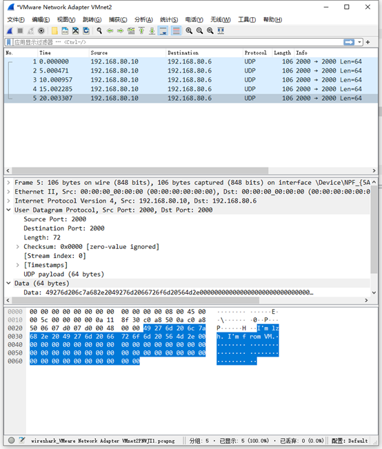

# Lab 2 send and receive packets with DPDK

## Part1

> Q1: What's the purpose of using hugepage?

大页可以减少TLB缓存项的使用，增大TLB命中概率；减少查询页表项的层数，提升查询效率。

> Q2: Take examples/helloworld as an example, describe the execution flow of DPDK programs?

具体执行流如下所示：

+ ```c++
  ret = rte_eal_init(argc, argv);
  ```

  rte_eal_init函数根据用户指定的参数进行各种初始化，构建一个针对包处理设计的运行环境。

+ DPDK是面向多核设计的，程序会试图独占运行在逻辑核(Icore)上。

  ```c++
  /* call lcore_hello() on every worker lcore */
  RTE_LCORE_FOREACH_WORKER(lcore_id) {
      rte_eal_remote_launch(lcore_hello, NULL, lcore_id);
  }
  ```

  该函数会遍历所有可使用的Icore，然后通过rte_eal_remote_launch函数在每一个lcore上启动被指定的线程。

+ ```c++
  /* call it on main lcore too */
  lcore_hello(NULL);
  ```

  主lcore也调用该函数。

+ ```c++
  static int
  lcore_hello(__rte_unused void *arg)
  {
  	unsigned lcore_id;
  	lcore_id = rte_lcore_id();
  	printf("hello from core %u\n", lcore_id);
  	return 0;
  }
  ```

  每个lcore都会打印自己的信息。

+ ```c++
  rte_eal_mp_wait_lcore();
  ```

  主lcore调用该函数挂起并等待其他lcore执行完毕。

+ rte_eal_cleanup清理环境，退出。

官方文档中的一张图很好地展示了相关流程。


> Q3: Read the codes of examples/skeleton, describe DPDK APIs related to sending and receiving packets.

| Api                                              | 作用描述                                                     |
| ------------------------------------------------ | ------------------------------------------------------------ |
| rte_eth_rx_queue_setup && rte_eth_tx_queue_setup | 为以太网设备分配和设置接收队列。对指定端口的某个队列，指定内存、描述符数量和报文缓冲区。 |
| rte_eth_dev_start                                | 启动以太网设备，开启网口。                                   |
| rte_eth_macaddr_get                              | 根据端口获取MAC物理地址。                                    |
| rte_eth_promiscuous_enable                       | 开启混杂模式，接受全部的报文。                               |
| rte_eth_rx_burst && rte_eth_tx_burst             | 基于端口队列的报文收发函数。                                 |

> Q4: Describe the data structure of 'rte_mbuf'.

主要结构如下图所示（源自于官方文档）。

rte_mbuf主要由元数据和数据包构成。rte_mbuf将元数据嵌入到单个内存缓冲区中，该结构后跟用于数据包数据的固定大小区域。元数据包含控制信息，例如消息类型、长度、到数据开头的偏移量以及用于允许缓冲区链接的其他 mbuf 结构的指针。

uint16_t nb_segs 表示当前的mbuf报文有多少个分段；struct rte_mbuf *next 表示下一个分段的地址。


## Part2

### 代码解释

+ fill_udp_pkt函数

  ```c++
  static void fill_udp_pkt(int port, struct rte_mbuf **bufs, int i) {
      printf("Start Filling.\n");
      char hello_msg[64];
      memset(hello_msg, 0, 64);
      strcpy(hello_msg, "I'm lzh. I'm from VM.");
      char *content = rte_pktmbuf_append(bufs[i], 64);
      rte_memcpy(content, hello_msg, 64);
  
      printf("Data part finished.\n");
  
      /* The length contains both udp header and the length of data. */
      unsigned int udp_pkt_len = 64 + UDP_HDR_SIZE;
      struct rte_udp_hdr *udp_hdr;
      udp_hdr = (struct rte_udp_hdr *) rte_pktmbuf_prepend(bufs[i], sizeof(struct rte_udp_hdr));
      udp_hdr->src_port = rte_cpu_to_be_16(SRC_PORT);
      udp_hdr->dst_port = rte_cpu_to_be_16(DST_PORT);
      udp_hdr->dgram_len = rte_cpu_to_be_16(udp_pkt_len);
      udp_hdr->dgram_cksum = 0;
  
      printf("Udp header part finished.\n");
  
      struct rte_ipv4_hdr *ip_hdr;
      ip_hdr = (struct rte_ipv4_hdr *) rte_pktmbuf_prepend(bufs[i], sizeof(struct rte_ipv4_hdr));
      ip_hdr->dst_addr = rte_cpu_to_be_32(RTE_IPV4(192, 168, 80, 6));
      ip_hdr->src_addr = rte_cpu_to_be_32(RTE_IPV4(192, 168, 80, 10));
      ip_hdr->version_ihl = 0x45;
      ip_hdr->total_length = rte_cpu_to_be_16(udp_pkt_len + sizeof(struct rte_ipv4_hdr));
      ip_hdr->next_proto_id = 0x11; //UDP
      ip_hdr->time_to_live = 0xa;
      ip_hdr->hdr_checksum = rte_ipv4_cksum(ip_hdr);
  
      printf("Ip header part finished.\n");
  
      struct rte_ether_addr s_addr, d_addr;
      rte_eth_macaddr_get(port, &s_addr);
      d_addr.addr_bytes[0] = 0x00;
      d_addr.addr_bytes[1] = 0x50;
      d_addr.addr_bytes[2] = 0x56;
      d_addr.addr_bytes[3] = 0xC0;
      d_addr.addr_bytes[4] = 0x00;
      d_addr.addr_bytes[5] = 0x02;
  
      struct rte_ether_hdr *ether_hdr;
      ether_hdr = (struct rte_ether_hdr *) rte_pktmbuf_prepend(bufs[i], sizeof(struct rte_ether_hdr));
      ether_hdr->ether_type = rte_cpu_to_be_16(RTE_ETHER_TYPE_IPV4);
      rte_ether_addr_copy(&ether_hdr->s_addr, &s_addr);
      rte_ether_addr_copy(&ether_hdr->d_addr, &d_addr);
  
      printf("Ethernet header part finished.\n");
  }
  ```

  该函数会依次装填udp，ip和ethernet的header。具体格式严格遵照协议规定，并严格使用大端表示法（使用dpdk提供的rte_cpu_to_be_xx系列函数进行小端到大端的转换）。

  注意到，放入udp的内容为"I'm lzh. I'm from VM."，目标ip地址为192.168.80.6，源ip地址为192.168.80.10。TTL设置为10。

+ 发送udp报文部分

  ```c++
  for (;;) {
      printf("Now send out a udp pkt.\n");
      for (int i = 0; i < BURST_SIZE; ++i) {
          struct rte_mbuf *bufs[BURST_SIZE];
          int retval = rte_pktmbuf_alloc_bulk(mbuf_pool, bufs, BURST_SIZE);
          if (retval != 0)
              printf("mbufs alloc failed\n");
          fill_udp_pkt(port, bufs, i);
          /* Send burst of TX packets. */
          const uint16_t nb_tx = rte_eth_tx_burst(port, 0,
                                                  bufs, BURST_SIZE);
  
          /* Free any unsent packets. */
          if (unlikely(nb_tx < BURST_SIZE)) {
              uint16_t buf;
              for (buf = nb_tx; buf < BURST_SIZE; buf++)
                  rte_pktmbuf_free(bufs[buf]);
          }
      }
      printf("Finished. Now wait for 5 secs\n");
      rte_delay_us_sleep(5000000);
  }
  ```

  主要参考了skeleton中使用的api和逻辑，用上面提到的fill_udp_pkt装填udp包，从port端口向外发出数据。

### 正确性验证

Wireshark截图如下所示：



不难发现，数据，ip源和目标地址，TTL等均符合代码中的设定，说明成功地使用dpdk发送了udp包。

### 说明

udp_sender的meson.build文件已更改，在本地使用ninja install指令能够正常编译。
