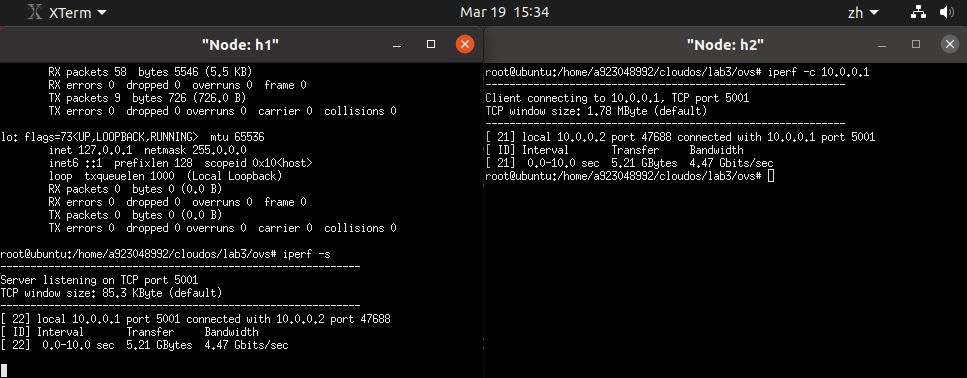
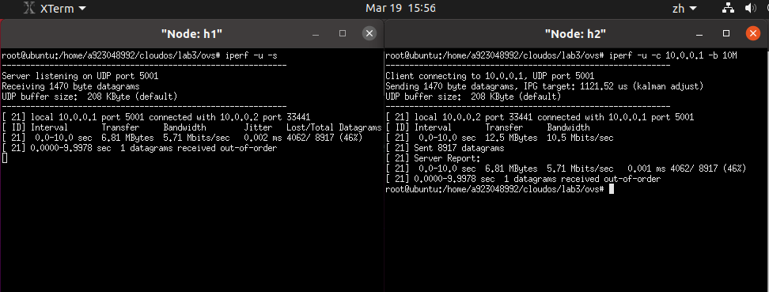
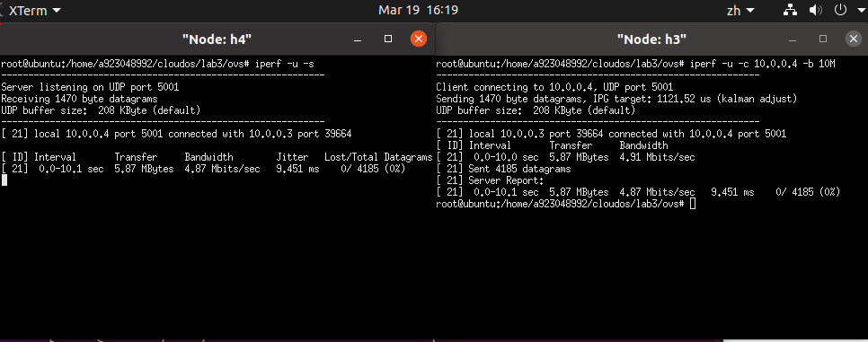
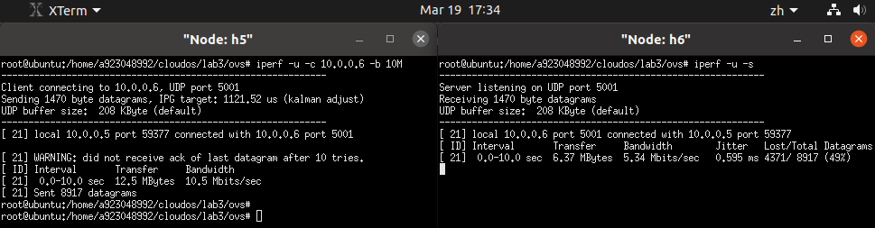
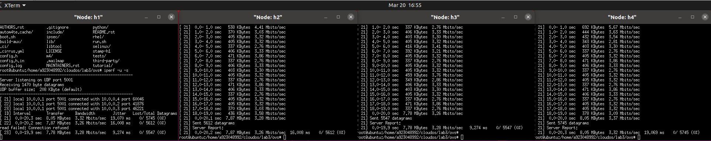

# Lab3

## Task 1

该task的实验截图如下所示：



## Task 2

### Task 2.1

该task的实验截图如下所示：



注意到，由于两张网卡的ingress rate都被设置为5000Kbps，一旦超过该阈值就会进行丢包。所以在发包过程中一些包会被丢弃，共丢弃了46%的包，带宽只达到了5.71Mbps。与此同时，丢包也会导致抖动。

### Task 2.2

该task的实验截图如下所示：



在使用shaping对发出的数据流量进行管控的情况下，如果超过了队列的最大速率，那么多余的包会被缓存起来。队列可以缓存和调度数据包的发送顺序。所以丢包率为0%（不像是policing那样进行简单的丢包）。一些包会被缓存或者调度，所以会有一定的抖动。带宽接近设置的最大传输速率。

### Task 2.3

> Question 1：尝试理解Line15,16两条指令，指出每条指令的具体⼯作是什么，并逐个分析其中各个参数的具体含义。

对于Line15的指令

```bash
ovs-ofctl add-flow s1 in_port=5,action=meter:1,output:6 -O openflow13
```

该指令用于下发流表s1，并且指定从端口5进入并从端口6出去的数据流会先经过流表，将多余的数据包丢弃，再转交给端口2发送出去。

s1是之前创建的meter表的名字；in_port代表数据流进入的端口号；meter:1代表使用1号meter表；output代表数据流出去的端口号。

对于Line16的指令

```bash
ovs-ofctl dump-flows s1 -O openflow13
```

该指令用于查看指定的流表。s1即先前创建的meter表。

该task的实验截图如下所示：



注意到，因为在流表中指定了超过5000Kbps就会进行丢包，所以以10M带宽传输丢包率达到了49%。丢包会产生一定抖动，因而Jitter为0.595ms，带宽略大于5Mbps。

> Question 2：到这⾥，你已经完成了三种限速⽅式的实验，并获得了三组测试数据，请你就三组数据 中的带宽、抖动和丢包率等参数，对三种限速⽅式进⾏横向⽐较，并适当地分析原因。

以下是三种Qos限速方式的横向对比表：

| 方式     | 带宽/Mbps | 抖动/ms | 丢包率/% |
| -------- | --------- | ------- | -------- |
| Policing | 5.71      | 0.002   | 46       |
| Shaping  | 4.87      | 9.451   | 0        |
| Meter    | 5.34      | 0.595   | 49       |

三者的带宽均接近设定的速率，而其中shaping的带宽最小，是因为调度会影响发包的速率，导致带宽降低。

Policing的抖动最小，因为它的实现逻辑很简单，就是简单的丢包，对于后续到达的包影响不大，抖动较小；而Shaping需要进行缓存和调度，容易造成较大的抖动。比如在突然来一大波流量的情况下，可能会产生较大的抖动。Meter介于两者之间，也采用丢包的方式，但是丢包的实现比Policing复杂，抖动也更大。

Policing和Meter都采用丢包的策略，故而都有接近50%的丢包率。而Shaping采用队列缓存多余的包，所以实现了0丢包率。

此外，Meter比前两者都更加灵活，可以设定各种qos方案。

### Task 3

该task的实验截图如下所示：



最终3个client的带宽稳定在了3.3Mbps左右。因为3个client的地位是相当的，所以相当于3个client平分10Mbps的带宽，每个client平均分到3.3Mbps。

### Task 4

该task的实验截图如下所示：

思路一：

.png)

思路二：

.png)

思路一：最终h2的带宽为5.3Mbps，h3的带宽为3.11Mbps，h4的带宽为1.61Mbps。

思路二：最终h2的带宽为5.05Mbps，h3的带宽为3.11Mbps，h4的带宽为1.55Mbps。

两者均为可行的方案，以下说明思路和实现使用的指令：

#### 实现思路和指令

##### 思路一：采用meter表

这个task考虑用更为灵活的meter方式。

考虑到h2必须占用大于5Mbps的带宽，h3必须占用大于3Mbps的带宽，那么留给h4的只有不到2Mbps的带宽，所以这边先创建一个下发给h4的meter：

限定带宽不能超过1600，否则进行丢包。

```bash
ovs-ofctl add-meter s1 meter=1,kbps,band=type=drop,rate=1600 -O OpenFlow13
```

下发给h4：

```bash
ovs-ofctl add-flow s1 in_port=4,action=meter:1,output:1 -O openflow13
```

对于h3，我们让其带宽在3000左右，新建meter2：

```bash
ovs-ofctl add-meter s1 meter=2,kbps,band=type=drop,rate=3100 -O OpenFlow13
```

下发给h3：

```bash
ovs-ofctl add-flow s1 in_port=3,action=meter:2,output:1 -O openflow13
```

##### 思路二：采用queue+meter表

queue不但可以设置max-rate还可以设置min-rate，题干的描述显然需要我们限定一个min-rate。

创建qos和三个队列：

```bash
ovs-vsctl set port s1-eth1 qos=@newqos -- \
--id=@newqos create qos type=linux-htb other-config:max-rate=10000000 other-config:min-rate=10000000 \
queues=0=@q0,1=@q1,2=@q2 -- \ 
--id=@q0 create queue other-config:min-rate=5000000 other-config:max-rate=5200000 -- \
--id=@q1 create queue other-config:min-rate=3000000 other-config:max-rate=3200000 -- \
--id=@q2 create queue other-config:max-rate=2000000
```

注意到这边q0对应h2，q1对应h3，q2对应h4。q0和q1都设置了max-rate，这是为了保证h4的带宽不会被h2和h3抢光。

下发流表，指定使用的队列：

```bash
ovs-ofctl -O openflow13 add-flow s1 in_port=2,actions=set_queue:0,output:1
ovs-ofctl -O openflow13 add-flow s1 in_port=3,actions=set_queue:1,output:1
ovs-ofctl -O openflow13 add-flow s1 in_port=4,actions=set_queue:2,output:1
```

